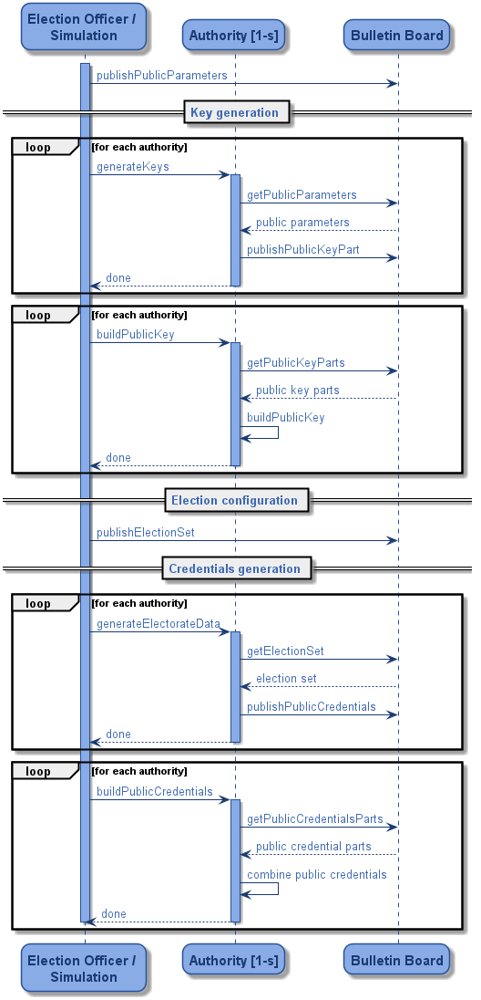
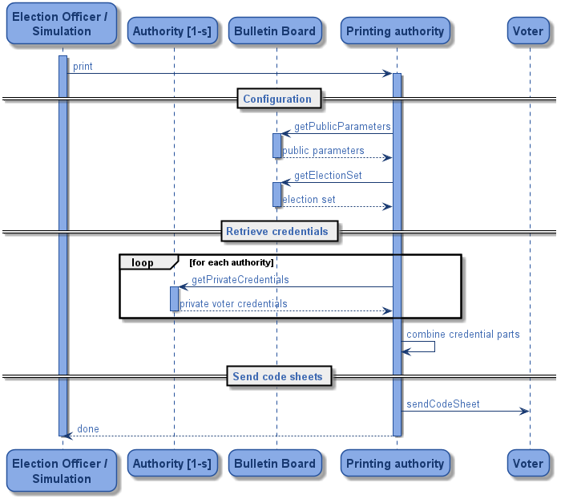
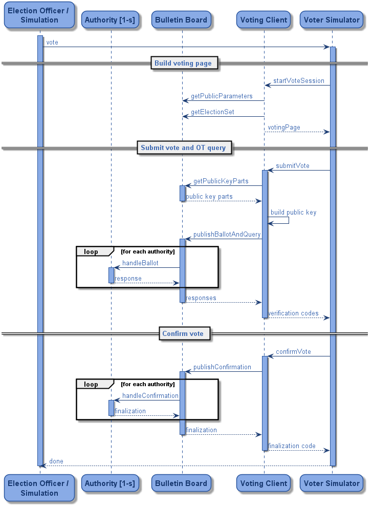
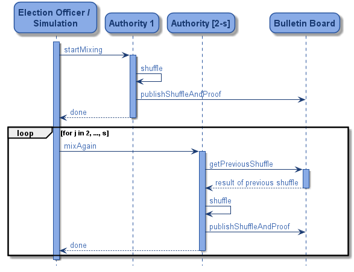
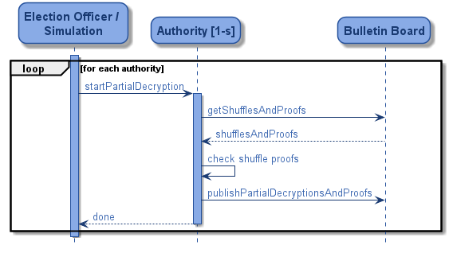
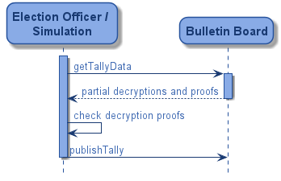

# Concept

## Introduction

The elements outlined in this document are detailed in the specification document provided at the [Cryptology ePrint Archive](https://ia.cr/2017/325).
This document aims to provide a faster overview, which entails some simplification.
The reference document should be used for a better understanding, for clarification of some details or as a reference
when challenging the security of this project.

## Parties and channels

The following parties partake in an election:

- The _election administrator_ is responsible for setting up an election event. 
  This includes tasks such as defining the electoral roll, the number of elections, the set of candidates in each 
  election, and the eligibility of each voter in each election. At the end of the election process, the election 
  administrator determines and publishes the final election result.
- A group of _election authorities_ guarantees the integrity and privacy of the votes submitted
  during the election period. They are numbered with indices j &isin; {1, ..., s}, s &ge; 1.
  Before every election event, they establish jointly a public ElGamal encryption key pk. 
  They also generate the credentials and codes to be printed on the code sheets. 
  During vote casting, they respond to the submitted ballots and confirmations.
  At the end of the election period, they perform a cryptographic shuffle of the encrypted
  votes. Finally, they use their private key shares skj to decrypt the votes in a
  distributed manner.
- The _printing authority_ is responsible for printing the code sheets and delivering them
  to the voters. They receive the data necessary for generating the code sheets from the
  bulletin board and the election authorities.
- The _voters_ are the actual human users of the system. They are numbered with indices
  i &isin; {1, ..., N}, N &ge; 0. Prior to an election event, they receive the code sheet from the
  printing authority, which they can use to cast and confirm a vote during the election
  period using their voting client.  
- The _voting client_ is a machine used by some voter to conduct the vote casting and
  confirmation process. Typically, this machine is either a desktop, notebook, or tablet
  computer with a network connection and enough computational power to perform
  cryptographic computations. The strict separation between voter and voting client is
  an important precondition for the protocol’s security concept.
- The _bulletin board_ is the central communication unit of the system. It implements
  a broadcast channel with memory among the parties involved in the protocol.
  For this, it keeps track of all the messages reveived during the protocol execution.
  The messages from the election administrator and the election authorities are kept in
  separate dedicated sections, which implies that bulletin board can authenticate them
  unambiguously. The entire election data stored by the bulletin board defines the input
  of the verification process.

## Cryptographic primitives

The protocol used in this prototype relies on the following primitives:
 
- El Gamal encryption
- Pedersen commitments
- Oblivious transfer
- Non-Interactive Preimage proofs
- Wikström's Shuffle Proof

## Parameters overview

### Security parameters

- The _minimal privacy_ &sigma; defines the amount of computational work for a polynomially
  bounded adversary to break the privacy of the votes to be greater or equal to `c * 2^σ` for
  some constant value c &gt; 0
- The _minimal integrity_ &tau; defines the amount of computational work for breaking the
  integrity of a vote in the same way as &sigma; for breaking the privacy of the vote. In
  other words, the actual choice of  determines the risk that an adversary succeeds in
  manipulating an election.
- The deterrence factor 0 &lt; &epsilon; &le; 1 defines a lower bound for the probability that an
  attempt to cheat by an adversary is detected by some honest party.
- The _number of election authorities_ s &ge; 1 determines the amount of trust that needs
  to be attributed to each of them. This is a consequence of our assumption that at
  least one election authority is honest, i.e., in the extreme case of `s = 1`, full trust is
  attributed to a single authority.
- The _encryption group_, a q-order subgroup of the multiplicative group of integers modulo a safe 
  prime `p = 2q + 1`.
  In addition to p and q, two independent generators `g, h ∈ G_q\{1}` of this group must
  be known to everyone. The only constraint when selecting them is the independence
  requirement.
- The _identification group, a q_hat-order subgroup of integers modulo a prime `p_hat = k*q_hat + 1`, 
  where q_hat is prime and `k ≥ 2` the co-factor. An arbitrary generator `g_hat ∈ G_q_hat\{1}`
  must be known to everyone.
- A _prime field_ is required in our protocol for polynomial interpolation during the
  vote confirmation process. The goal of working with polynomials is to prove the
  validity of a submitted vote in an efficient way.
- Length and alphabet definitions for the following codes:
  - Voting codes: used for identifying the voters
  - Verification codes: used for cast-as-intended verification
  - Confirmation codes: used for validating the ballot once the cast-as-intended checks have been 
    completed
  - Finalization codes: used as acknowledgement of the confirmation
  
### Election parameters

The election parameters are shared on the bulletin board.
<dl>
    <dt>Election event</dt>
    <dd>An <em>election event</em> may consist of several elections. Elections are indexed with j &isin; [1, t]</dd>
    <dt>Election</dt>
    <dd>An <em>election</em> features n_j candidates and allow k_j selections per eligible voter</dd>
    <dt>Electorate</dt>
    <dd>N_E denotes the number of eligible voters in an <em>election event</em>.</dd>
    <dt>Voters</dt>
    <dd>Eligible <em>voters</em> are indexed with i &isin; [1, N_E]</dd>
    <dt>Eligibility matrix</dt>
    <dd>The matrix <strong>E</strong> contains all e_{i,j} bits, where each e_{i,j} bit is true if and only if voter 
    i is eligible for election j</dd> 
</dl>

## Sequence diagrams

This section introduces the sequence diagrams of the simulation process and will need to be adjusted for
real context usage.

### Initialization

### Code sheet printing

### Vote casting phase

### Mixing

### Decryption

### Tallying

